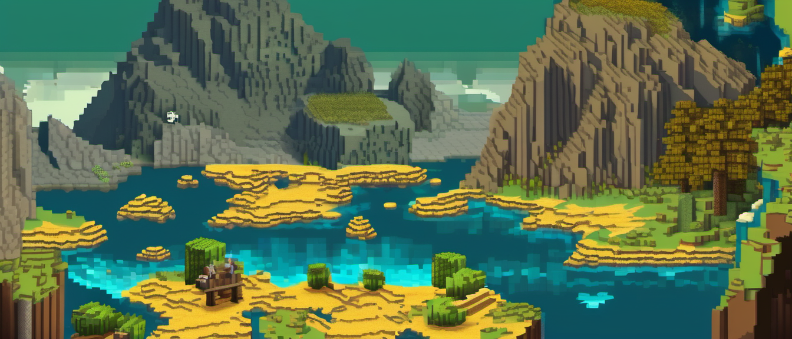

# Retrograde



Minecraft mod that tracks which chunks you've actually touched vs. chunks
that are just sitting there unexplored, shows a real top-down terrain map
with an ore tally per chunk, and lets you select chunks on that map and
regen them (with undo) or hand them to another mod's own retrogen.

Not trying to auto-detect "what's missing" for every mod out there, that's
not something you can know without re-running world generation. Instead it
wraps other mods' own retrogen commands (currently just Mekanism) so you
don't have to leave the map screen to use them.

## Targets

| MC version | Loaders |
|---|---|
| 1.20.1 | Fabric, Forge |
| 26.1 | Fabric, NeoForge |
| 26.3 | Fabric, NeoForge (NeoForge is still beta for 26.3) |

1.20.1 pairs with Forge instead of NeoForge since the Forge/NeoForge split
didn't happen until 1.20.2.

## Building

Stonecutter project, so only one version's source tree is active at a time.
Switch before building:

```
./gradlew "Set active project to <version>-<loader>"   # e.g. 1.20.1-fabric
./gradlew :<version>-<loader>:build
```

Keep those as two separate commands, chaining them in one invocation trips
a Gradle task-ordering check.

## Status

All 6 version/loader combos build. Chunk tracking, the terrain map, the
keybinding to open it, regen + undo, per-chunk ore info, and the Mekanism
retrogen integration all work everywhere, including 26.3.

The map is full-screen now: drag to pan, scroll to zoom toward the cursor,
with a small floating title pill top-center and a compact recenter/zoom/close
icon cluster top-right - both styled like a normal minimap mod's chrome
(bordered chips over the map) instead of the flat full-height side panel
earlier versions had. Renders real terrain (same color-per-block approach
vanilla's held map item uses) with a translucent tint over touched chunks
and your own position, plus chunk grid lines.

Chunks the server has in memory are read from memory; everything else is
decoded straight out of the region file, so the map covers everywhere
you've explored rather than the few hundred blocks around you. Grey means
nothing has ever been generated there, not "walk closer". Biome and ore
tally come out of that same read and are cached with the terrain, so every
chunk the map has drawn can also be described - and searched.

Down the left side are two fixed panels. The top one describes whatever
chunk is under the cursor - coordinates, touched/untouched, biome, ore tally
as icons - at a fixed size, in a fixed place, so it isn't covering the
chunks you're trying to read. The ore tally only has room for six, so a
toggle beside its heading opens the full breakdown - every ore with its name
and count - in its own panel alongside, rather than leaving the rarest ones
hidden behind a "+4" you can't do anything with.

The one below it is the selection: shift-drag to box-select a region,
ctrl-drag to deselect, click to toggle a single chunk, then pick Chunk
Manipulation, Find or Clear. Selected chunks are tinted and outlined on the
map, and the panel says how many are selected and how many of those you've
touched.

Both panels size themselves to the window rather than to fixed numbers.
That matters more than it sounds: the fixed layout wanted 253 of the 256
rows a 1366x768 screen has at GUI scale 3 just for the left column, and 342
of its 455 columns once the filter was open, which left the map itself a
113px strip. Panels now shrink toward a floor, the ore icon grid drops to
one row and then disappears entirely when the window is short, and the
ore/filter panel moves to the right edge - or, on a really small window, on
top of the left column - instead of taking another bite out of the middle.

Chunk Manipulation is where everything that changes a chunk lives:
Regenerate, Undo, another mod's Retrogen, and whatever else is switched on.
It's one button rather than five because the action panel stays two rows
tall however long that list gets, and because operations that rewrite your
world deserve a screen that can explain them rather than a tooltip.

The gear in the icon cluster opens settings: slime chunks, confirmation on
destructive actions, the opaque progress backdrop, how long a job waits for
a chunk to unload, how long it may stall before the watchdog puts you back
- and a master switch for operations that can hand you things you didn't
earn. That switch is off by default, and while it's off those operations
aren't greyed out, they're absent, so a world you meant to play straight
never shows you the button. Settings live in
`config/retrograde.properties`.

Slime chunks are tinted green on the map and called out on the info panel,
via vanilla's own `seedSlimeChunk` rule rather than a reimplementation of
the scramble. Overworld only - the same maths produces a perfectly
convincing and entirely meaningless pattern in the Nether.

Biome editing (behind the extras switch) rewrites the selection's biome in
place through vanilla's `fillbiome`, picked from every biome the world
registered rather than just the ones you've visited. It runs against a
permission-4 command source built from the server, so it works in a world
that doesn't have cheats on - the gate is Retrograde's setting, not the
world's. Nothing moves: a desert turned swamp is a desert with swamp fog,
mob spawns and grass colour. Reshaping the terrain to match is a regen,
which is a different button in the same menu.

A bare left-drag pans, which is what dragging a map does everywhere else; box
selection is the same drag with shift held. Right-drag and middle-drag also
pan, and so do WASD and the arrow keys, with +/- to zoom. A click only counts
as a click if the mouse didn't move far enough to register as a drag, which is
what lets one button be both "pan" and "toggle this chunk" without them
fighting each other.

Find opens a filter panel beside the info panel: pick a scope (what's on
screen, within 4/8/16 chunks of you, or everywhere the map has read), then
narrow it by touched/untouched, by biome, and by an ore having to be present
or absent. The biome and ore choices are cycled from what's actually out
there rather than typed, so there's nothing to spell and no way to land on a
filter that can't match. Matches light up amber on the map as you change the
filter, with a live count and one button to select all of them - nearest
first, since a filter can match more chunks than the 256 cap allows. Clear
and the filter both keep the previous selection, and Restore puts it back.

Regenerate opens a preview rather than a yes/no box, since it's the one
action here that destroys work: how many chunks, how many you've built in,
how many have an undo snapshot behind them, roughly how long it'll take, and
the ore tallied across the whole selection.

All three actions run over the whole selection behind a progress screen -
phase, progress bar, which chunk it's on, and done/skipped/failed counts,
with a Cancel that stops cleanly instead of abandoning you mid-run. Regen
can't touch a chunk that's currently loaded (a loaded chunk saves itself
back over the edit), so rather than refusing, the job parks you above the
build height clear of the selection, waits for the chunks to unload, does
the work, and puts you back exactly where you were. Anything still loaded
after 30 seconds - forced chunks, spawn chunks - is reported as skipped
rather than forced.

The keybinding to open the map defaults to O, picked for being free rather
than for being memorable: M and Y are minimap territory, J is JourneyMap, R
and U belong to JEI, G to Curios, and JourneyMap takes the brackets for zoom
on top of that. Rebindable like anything else.

Not done: more retrogen integrations beyond Mekanism, multiplayer support,
searching chunks the map has never read (see ROADMAP.md).

### What's actually been verified

Earlier versions were run in a real game, not just compiled - that's how the
original "everything shows as unloaded" bug got found and fixed (the map
screen was reading chunk data straight off the render thread; only the
server's own thread can do that), how the zoom buttons got confirmed
working, and how the title chip, icon cluster, chunk grid, and ore readout
were confirmed to render, screenshotted live in a 1.20.1 world.

The selection UI, the progress screen, the teleport-out-and-back regen job,
the saved-chunk reader, the chunk filter, the regen preview, the responsive
layout, the Chunk Manipulation menu, the settings screen, slime chunks and
biome editing are new and have a clean compile on all six targets behind
them, nothing more. The responsive layout's thresholds were worked out
against the arithmetic rather than by looking at it, so the tiers are
reasoned, not seen.

Four things there were checked against the shipped classes rather than
assumed, because all four would fail silently or crash on a version that
disagreed: `Minecraft#gameDirectory` is a public `File` on all three MC
versions (so settings need no per-loader config path), `fillbiome` is
present in all three (6, 7 and 9 occurrences respectively),
`Commands#performPrefixedCommand` and `MinecraftServer#createCommandSourceStack`
are unchanged, and `WorldgenRandom#seedSlimeChunk(int,int,long,long)` has
the same signature on 26.1 and 26.3 - 26.3 moving the Slime entity into a
cubemob package didn't touch it. 1.20.1's jar is fully obfuscated so it
can't be checked that way; that it compiles there is the evidence. Anything
needing a mouse is unverified in general: the environment I can test in has
keyboard input only, so drag-to-pan, scroll-to-zoom, click-to-select,
box-select, the ore breakdown toggle and every button on the filter panel
have only compiling and a careful read of the code behind them.

The saved-chunk reader has now been pointed at real saves, and it needed it.
It decodes the region file's palettes by hand, and the first version assumed
the entry format was the same on every target; it isn't. 26.3 writes default
block states as bare strings and keys the rest `id` rather than `Name`, so
every 26.3 chunk decoded as solid air and drew as a black square with no
biome and no ores. It now handles all four shapes, checked by decoding ~15,000
palette entries out of a real 1.20.1 world and a real 26.3 one with zero
unresolved; the packed-long bit widths were validated the same way over about
600 sections. A format change here shows up as a silently wrong map rather
than a crash, which is why it's now checked against saved worlds instead of
reasoned about. The 26.x `GuiGraphicsExtractor`
render path is compile-only as always - no Wayland-friendly way to launch
26.1/26.3 and look at it yet.

One thing that is verified, because it was checked against the shipped
classes rather than guessed: 26.3 moved its input backend from GLFW to SDL,
which renumbers both the mouse buttons (left is 1, not 0) and the
non-printable keys (arrows are in SDL's 0x40000000 range). `ChunkMapScreen`
carries a separate set of constants for 26.3 because of it. Anything else
reading raw button or key numbers on 26.3 needs the same treatment.

## Credit

Started from [Mat0u5/MinecraftModTemplate](https://github.com/Mat0u5/MinecraftModTemplate)
(MIT licensed).
